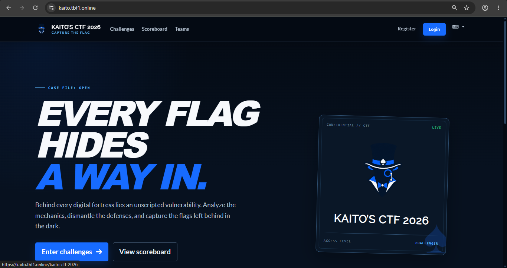
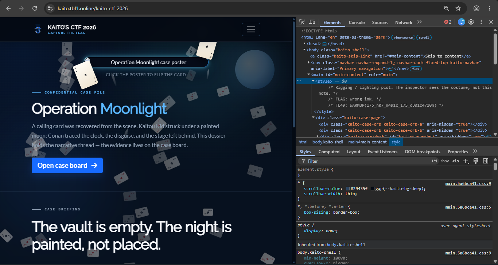
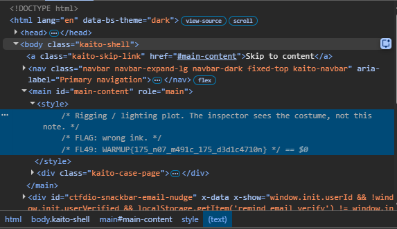

# Kaito CTF - Welcome Flag

- Write-Up Author: Ben Ten
- Category: Beginner
- Flag: `WARMUP{175_n07_m491c_175_d3d1c4710n}`

## Challenge Description

The flag is hidden here somewhere

## Steps to Find the Flag

1. Take a look at the homepage, there's a spade card icon there. Maybe you can find something there?

   <!-- SCREENSHOT: homapage event CTF -->
   

2. After clicking the spade icon, you’ll be redirected to the kaito-ctf-2026 page. Open the ```Inspect``` menu and select the ```Element``` tab.

   <!-- SCREENSHOT: inspect halaman poster -->
   

3. Look for the design code (CSS) within the main content area of this web page. Haha, the flag is hidden here.

   <!-- SCREENSHOT: style element berisi flag -->
   

## Conclusion

The flag was hidden within the web page's source code using the Source Code Comment Hiding technique. By placing the flag inside comment tags ```(/* ... */)``` within the ```<style>``` block, the author kept the text invisible on the front-end user interface.

However, this was easily uncovered through Information Gathering by using the browser's Inspect Element feature. Navigating to the Elements tab exposed the raw source code, making the hidden comment fully visible. This challenge highlights a critical security lesson: developers should never leave sensitive data or internal notes in source code comments, as they can be trivially accessed via basic developer tools.

**Flag:** `WARMUP{175_n07_m491c_175_d3d1c4710n}`