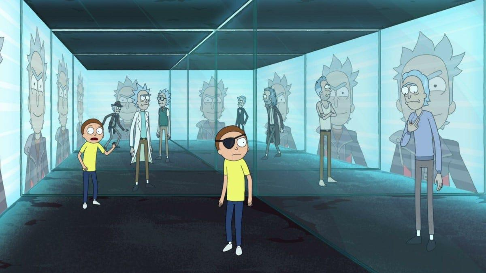

# The Omega Trigger

- Write-Up Author: Ben Ten
- Category: Crypto
- Flag: `Kaito{0m3g4_d3v1c3_matsumoto_imai_patarin_differential}`

## Challenge Description

[MORTY]: "Aw Rick! We—we jumped through his portal signature, but where the hell are we?! The doors just slammed shut!"

[RICK]: "Shut up, Morty! (burp) It's a localized gravity cage. He knew we were tracking him through the Curve."

[A holographic projection of Rick Prime flickers to life in the center of the vault]

[RICK PRIME]: "Look at you, C-137. Still crying over dead wives across dead timelines? You built a whole wall around infinite universes just to feel like the smartest guy in the room, and you still couldn't touch me. I left the master trigger to the Omega Device right here. To arm it, you just have to solve the system. But let's be honest your math is as pathetic as your emotions. Good luck, sad boy. You're gonna need infinity."

[The hologram flickers and shuts off]

[MORTY]: "Rick... there's—there's a glowing 'Buy Hint' button on the console panel..."

[RICK]: "Morty! Don't you dare touch that fucking button! Whatever happens, DO NOT press it! We are NOT giving that sociopathic bastard the satisfaction of watching us beg for help!"

`nc 31.97.37.38 1339`

## Steps to Find the Flag

1. Analisis skema kriptografi Multivariate Quadratic (MQ) yang diberikan.
2. Pahami bahwa sistem MQ tersebut dapat direduksi menjadi sistem linear GF(2) melalui respons IO yang berurutan (pipelined).
3. Selesaikan sistem linear tersebut menggunakan metode Eliminasi Gauss untuk memecahkan persamaan dan memulihkan data flag.

## Conclusion

Kelemahan skema MQ yang dapat direduksi memungkinkan pemecahan menggunakan aljabar linear standar atas GF(2).

**Flag:** `Kaito{0m3g4_d3v1c3_matsumoto_imai_patarin_differential}`
