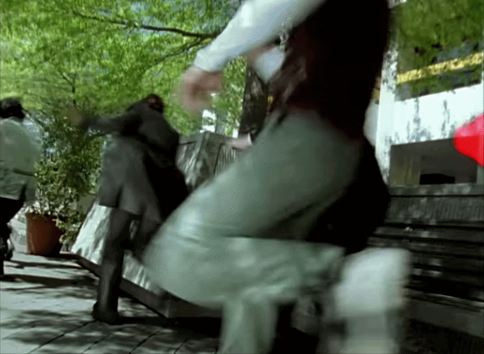

# Kaito CTF - That Creepy Episode

- Write-Up Author: Ben Ten
- Category: Osint
- Flag: `Kaito{Dogged_6}`

## Challenge Description

I remember catching this weirdly unsettling scene on TV as a kid and it stuck with me.........for years. Can you track down the episode title and the minute mark where this clip appears?

Flag format: Kaito{EpisodeName_M} (e.g., Kaito{Beginnings_4})

## Steps to Find the Flag

1. **Analisis Media Dasar:** Tantangan ini memberikan sebuah file GIF yang menampilkan adegan spesifik: dua orang sipil di kursi taman ditembak dengan laser merah hingga mencair menjadi lendir hijau. Kualitas visual dan gaya efek CGI yang digunakan sangat mengindikasikan bahwa cuplikan ini berasal dari acara tokusatsu atau serial aksi era awal 2000-an.
2. **Ekstraksi Frame & Reverse Image Search:** Untuk mendapatkan kecocokan gambar yang akurat, GIF dipecah menjadi beberapa *frame*. Menggunakan frame yang paling jelas (saat karakter berubah menjadi hijau atau saat efek laser muncul) pada mesin pencari seperti Google Lens atau Yandex Images langsung mengarah pada serial Power Rangers S.P.D. (diadaptasi dari *Tokusou Sentai Dekaranger*).
3. **Identifikasi Judul Episode:** Melakukan pencarian spesifik di wiki atau *fandom database* Power Rangers dengan kata kunci seperti "*Power Rangers S.P.D. green slime monster*" mengungkap bahwa monster yang mengubah manusia menjadi cairan bahan bakar tersebut bernama Rhinix. Karakter monster ini adalah antagonis utama pada Episode 5 yang berjudul "Dogged".
4. **Verifikasi Timestamp:** Sesuai dengan petunjuk format flag `Kaito{EpisodeName_M}`, langkah terakhir adalah memeriksa file video episode "Dogged" untuk menemukan menit ke berapa (`M`) adegan tersebut terjadi. Setelah melewati beberapa adegan awal (pencarian boneka Syd dan adegan pengenalan di markas), adegan serangan Rhinix di taman secara presisi dimulai pada menit ke-6.

## Conclusion

Tantangan ini merupakan latihan OSINT dan *Media Forensics* klasik yang menguji kemampuan melakukan *Reverse Image Search* dari potongan frame sebuah video. Kesulitan utamanya bukan hanya pada identifikasi judul media, melainkan kejelian melakukan *scrubbing* manual pada sumber video penuh untuk memvalidasi *timestamp* pasti sesuai dengan format *flag* yang diminta.

**Flag:** `Kaito{Dogged_6}`
