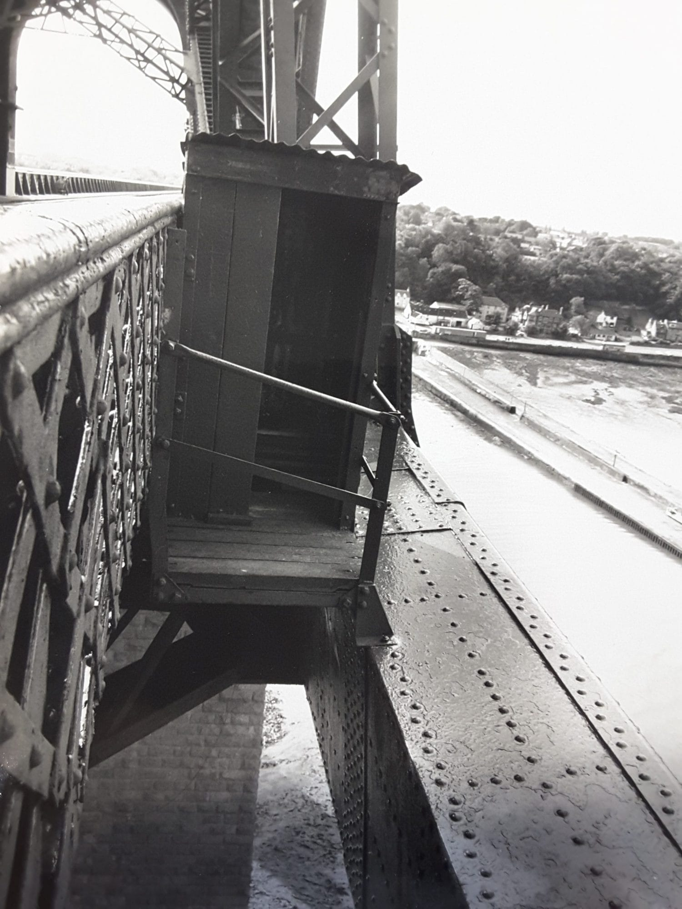

# Kaito CTF - What a Good Spot

- Write-Up Author: Ben Ten
- Category: Osint
- Flag: `Kaito{55.994,-3.385}`

## Challenge Description

Contractor was told to pick a spot with good ventilation.

They bolted a wooden shed to the side of a rail bridge, 150 feet over the water, and called it a day. Honestly? What a good spot.

Find the coordinates of this toilet.

Flag format: Kaito{lat,lon} to 3 decimal places
Example: Kaito{12.123,4.567}

## Steps to Find the Flag

1. Lakukan Reverse Image Search pada file `view.jpg` menggunakan Google Lens atau Yandex.
2. Identifikasi landmark jembatan tersebut, yaitu Forth Bridge (Firth of Forth) di Skotlandia.
3. Lakukan pencarian spesifik (dorking) terkait "wooden shed toilet on Forth Bridge".
4. Dapatkan lokasi presisi dari toilet kayu tersebut melalui artikel, dokumentasi, atau Google Maps.
5. Ambil koordinat lintang dan bujur hingga 3 angka di belakang koma (55.994, -3.385).

## Conclusion

Metode yang digunakan mencakup Reverse Image Search dan analisis geolokasi tingkat lanjut (Geoguessing/OSINT). Setelah jembatan utama diketahui, pencarian difokuskan ke fitur unik (toilet gantung) untuk memetakan koordinat absolutnya.

**Flag:** `Kaito{55.994,-3.385}`
